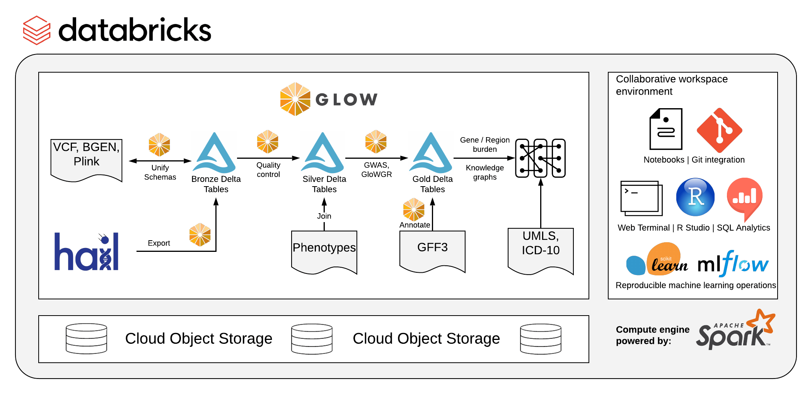

```{r, include=FALSE}
knitr::opts_chunk$set(echo = TRUE, eval = FALSE)
library(dplyr)
library(flextable)
```


Every seven months, the volume of genomics data [doubles](https://glow.readthedocs.io/en/latest/introduction.html). As a result, scientists in this field face big data challenges such as data management and designing efficient algorithms. In this post, we will attempt to apply [Glow](https://glow.readthedocs.io/en/latest/index.html) solution to create big data architectures to genomics data.
Glow is built on [Apache Spark](https://spark.apache.org/) and [Delta Lake](https://delta.io/), two popular big data technologies for distributed data processing and storage. 



We try to read the last version of GRCh38 [dbSNP](https://ftp.ncbi.nlm.nih.gov/snp/organisms/human_9606_b151_GRCh38p7/VCF/) and store it in delta format. To read VCF data, we need to open a Spark session with spark-shell and add dependencies. To add Glow and Delta dependencies to the Spark Session, first go to the Spark source directory, then run the command below.

```{bash,}
./bin/spark-shell --master local[20]\ 
  --packages io.projectglow:glow-spark3_2.12:1.1.2,io.delta:delta-core_2.12:1.0.1
```

To choose the delta.io version, you need to find a compatible version with your spark version. 
The proper delta version for your spark can be found in the table below.

```{r,echo=FALSE, eval=TRUE}
tibble::tribble(
  ~Delta.Lake.version,	~Apache.Spark.version,
  "1.1.x", "3.2.x",
  "1.0.x", "3.1.x",
  "0.7.x and 0.8.x", "3.0.x",
  "Below 0.7.0", "2.4.2 - 2.4.<latest>"
  ) %>% 
flextable() %>% 
  set_caption(caption = "Performance characteristics of sequence types") %>% 
  autofit() %>% 
  color(color = "white", part = "header") %>% 
  color(color = "white") %>% 
  add_footer('Delta.Lake.version' = "source: docs.delta.io" ) %>% 
  merge_at(j = 1:2, part = "footer") %>% 
  color(color = "white", part = "footer")
```

Spark downloads jar file dependencies in `.ivy2/jars` directory at your home.
It is sufficient to add the jars directory to Spark if you do not want to download dependencies again.

```{bash}
./bin/spark-shell --master local[20] --jars "~/.ivy2/jars/*"
```

Because some fields of SNP data contain very large character content, it is better to increase the Java heap memory. Look in the conf folder in the Spark directory and
add the following to `spark-defaults.conf`:

```{YAML}
spark.memory.offHeap.enabled     true
spark.memory.offHeap.size        2048m
```

We open the Scala REPL with a spark session after running the `spark-shell`. 
Although the Spark Shell can be used to build Spark Scala API codes, it lacks the user-friendliness of IDEs. It's much easier to write codes and then paste into the REPL. Using the `:paste` command in the REPL provides a quick way to paste multiline codes.

```{scala}
scala> :paste
// Entering paste mode (ctrl-D to finish)
```

To add the `VCF` reader format to Spark, import the Glow library and register the Spark session.

```{scala}
import io.projectglow.Glow
Glow.register(spark)
```

Below, the SNP data is read and some columns are renamed and selected.

```{scala}
val vcf_df = spark.read.format("vcf")
  .load("./data/00-All.vcf.gz")
  .withColumn("ID",explode(col("names")))
  .drop("names","genotypes")
  .select(
    col("contigName").as("CH"),
    col("start").as("POS"),
    col("ID"),
    col("end").as("END"),
    col("referenceAllele").as("REF"),
    col("alternateAlleles").as("ALT")
    )
```

Spark jobs are lazy. To see results, it needs some actions, like a simple `show` function.

```{scala}
vcf_df.show
vcf_df.printSchema
```

Delta Lake is a data format that is based on Apache Parquet but has been optimized for analytic tasks. 
To write data in delta format, use the below code.
```{scala}
vcf_df
  .write
  .mode("overwrite")
  .format("delta")
  .save("./data/SNP_GRCh38.delta")
```

Now data is ready to Play!

```{scala, comment = "scala> "}
val snp = spark
  .read
  .format("delta")
  .load("./data/SNP_GRCh38.delta")

snp.groupBy("CH").count.show(30)
```


# Refrences

- [Introduction to Glow](https://glow.readthedocs.io/en/latest/introduction.html)
- [Glow V1.0.0, Next Generation Genome Wide Analytics](https://databricks.com/blog/2021/03/09/glow-v1-0-0-next-generation-genome-wide-analytics.html)
