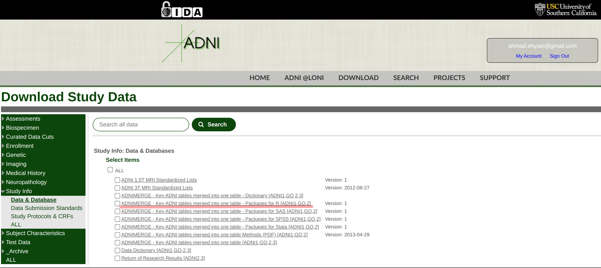

```{r, include=FALSE}
knitr::opts_chunk$set(message = FALSE, warning = FALSE, error = FALSE, 
                      cache = TRUE, dev = "svg")
```

## What is ADNI Dataset?

The Alzheimer’s Disease Neuroimaging Initiative (ADNI) unites researchers with study data as they work to define the progression of Alzheimer’s disease (AD). ADNI researchers collect, validate and utilize data, including MRI and PET images, genetics, cognitive tests, CSF and blood biomarkers as predictors of the disease. Study resources and data from the North American ADNI study are available through this website, including Alzheimer’s disease patients, mild cognitive impairment subjects, and elderly controls.

# How to Get the ADNI Dataset?


For R users, the ADNI project has developed a data package [ADNIMERGE](https://adni.bitbucket.io/) which contains coded data, documentation, and analysis vignettes.
To install the package first, we need to download the source code `ADNIMERGE_0.0.1.tar.gz` from [LONI](http://adni.loni.usc.edu/).
In ADNI's download section, you can find the package source as you see in the below image.



After downloading the compressed `ADNIMERGE_0.0.1.tar.gz` file, it can be installed on your R system by entering the following R code.

```{r , eval=FALSE, echo = TRUE}
install.packages("./ADNIMERGE_0.0.1.tar.gz", repos = NULL, type = "source")
```

To load data, you need only call `adnimerge` inside `ADNIMERGE` package.

```{r load_adnimerge_data, echo = TRUE}
library(ADNIMERGE)
data(adnimerge)
```

A `adnimerge` has `r nrow(adnimerge)` records and `r ncol(adnimerge)` fields.
At ADNI, there are many fields, so it is hard to explore data at first glance. In these situations, the `summarytools` R package is very helpful. The function `dfsummary` creates a pretty data summary table.You can use below script to install package:

```{r, eval=FALSE, echo=TRUE}
remotes::install_github("dcomtois/summarytools", build_vignettes = TRUE)
library(summarytools)
dfSummary(adnimerge)
```


```{r,echo=FALSE}
library(summarytools)
print(dfSummary(adnimerge, 
                varnumbers   = FALSE, 
                valid.col    = FALSE, 
                graph.magnif = 0.76),
      method = 'render')
```


